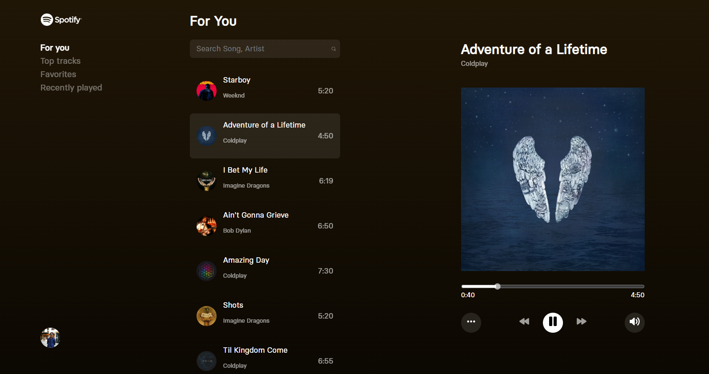
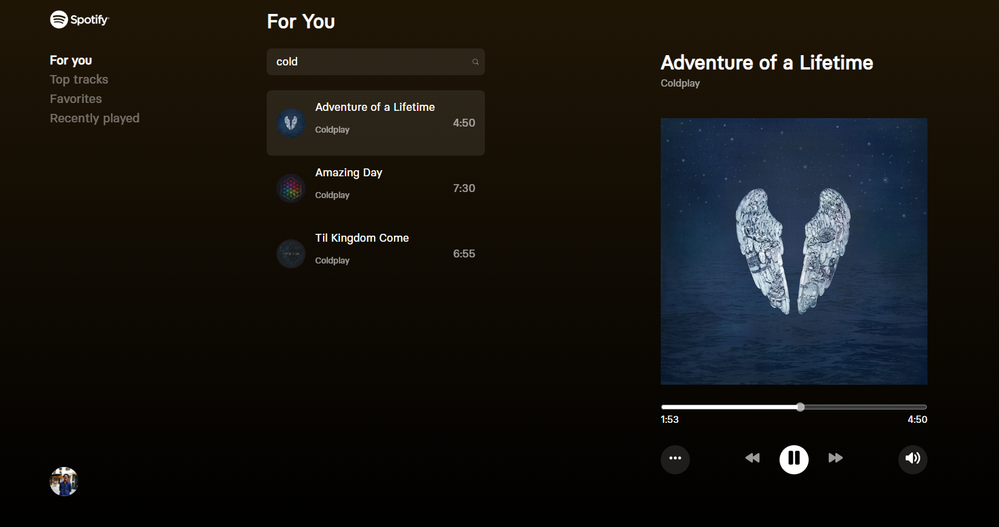

# Music Player App

Welcome to the Music Player App, an immersive and feature-rich web application that brings the joy of music right to your fingertips! This repository contains the development branch of our cutting-edge Music Player, built with the latest web technologies to offer you a seamless and delightful music listening experience.

## 🎵 Introduction

The Music Player App is a revolutionary web application that combines the power of React, GraphQL integration, Vanilla CSS, and other advanced technologies to deliver an unparalleled music experience. Whether you're a music enthusiast, a casual listener, or someone looking for the perfect soundtrack to complement your day, our app has something special for everyone.

## 🎧 Key Features

- **Seamless GraphQL Integration:** The Music Player App seamlessly integrates with GraphQL, providing lightning-fast data retrieval and ensuring a smooth browsing experience.

- **Customized Vanilla CSS:** We have crafted every visual element with precision using Vanilla CSS, resulting in an appealing and unique user interface that will captivate you from the moment you arrive.

- **Dynamic Navigation with React-Router-6:** Navigate through the app with ease using React-Router-6, allowing for dynamic page transitions and a seamless user journey.

- **Immersive Animations:** Be mesmerized by the elegant animations that enhance the visual experience and interactions, making your time on the app even more enjoyable.

- **React Skeleton for Loading Placeholders:** Say goodbye to waiting! React Skeleton provides elegant loading placeholders while fetching data, giving you a seamless browsing experience.

- **Responsive Grid Layouts:** Our app is designed to adapt gracefully to various screen sizes using CSS grids, ensuring a consistent and visually pleasing layout on all devices.

- **Efficient State Management with Context:** We have employed the React Context API for efficient state management across the app, ensuring responsiveness and seamless functionality.

- **Intuitive Search Functionality:** Easily find your favorite songs or artists with our intuitive search feature, making music discovery a breeze.

## 🎶 Let the Music Play

Immerse yourself in the world of melodies and rhythms with the Music Player App. Browse through our vast collection of songs, explore different artists, and indulge in a seamless playback experience with play, pause, next, and previous track controls at your fingertips.

## 📷 Screenshots


_Description: Home page with a list of songs and search bar_


_Description: Playing a song with the control buttons_

## 🚀 Getting Started

To experience the magic of the Music Player App, follow these simple steps:

1. Clone the repository to your local machine.

```bash
git clone <repository-url>
```

2. Install the dependencies.

```bash
cd music-player-app
npm install
```

3. Run the development server.

```bash
npm start
```

4. Open the app in your browser.

```text
http://localhost:3000
```

## 🎵 Play Your Heart Out

The Music Player App is more than just a music player; it's an exploration of melodies, emotions, and rhythm. So, sit back, relax, and let the music take you on an unforgettable journey.

## 🎉 Let's Contribute

We welcome contributions from developers like you! Whether you have ideas for new features, want to report a bug, or have some enhancements in mind, feel free to open an issue or submit a pull request.

## 📄 License

The Music Player App is open-source and available under the [MIT License](LICENSE). Feel free to use, modify, and distribute the code as per the terms of the license.

Let the music play and enjoy the magic of our Music Player App! 🎶🎉
